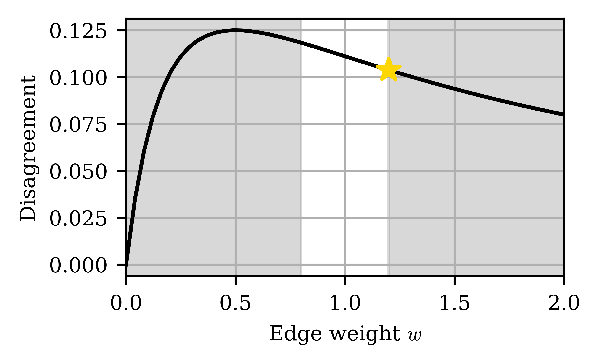

Getting Started
===============

Simple Example
--------------

To demonstrate basic usage of **BeeRS**, we start with a simple example. Consider the follwing network:

The internal opinions are given by :math:`s_0 = 1` and :math:`s_1 = 0`, and the initial edge weight is
:math:`w = 1`. We want to find the weight :math:`w`, such that disagreement, defined as

.. math::

    D(w,y) := \frac{1}{2} \sum_{i=1}^n \sum_{\substack{j=1 \\ j \neq i}}^n w_{ij} (y_i - y_j)^2

is minimized. We add some constraints to restrict the possible interventions of the leader. The resulting
problem is given by:

.. math::
   \DeclareMathOperator*{\argmin}{\arg\!\min\,}
   \begin{aligned}
   & \min_{w_{01}, w_{10}} && D(w,y) \\
   & \text{s.t.} && A(w)y = s \\
   & && w_{01}, w_{10} \geq 0 \\
   & && w_{01} = w_{10} \\
   & && \lVert W - W_0 \rVert_F \leq \delta \lVert W_0 \rVert_F,
   \end{aligned}

where :math:`\lVert \cdot \rVert_F` denotes the Frobenius norm, :math:`\delta \in \mathbb{R}_{\geq 0}` is a parameter, and
:math:`W_0` represents the initial adjacency matrix of the network.
As we consider an undirected network, we introduce two directed variables :math:`w_{01}` and :math:`w_{10}` and add
the constraint :math:`w_{01} = w_{10}`. This problem is heavily inspired by the work :cite:`filterbubble`.

To solve the problem with **BeeRS**, we proceed as follows. For this example, we use the CPU implementation
:ref:`BeersCpu <beers-cpu-class>`. 

First, we import some packages.

.. code-block:: python

    import cvxpy as cp
    import numpy as np
    import torch

Specifying the Network
----------------------

The network is specified by its adjacency matrix and the internal opinions of its users.

.. code-block:: python

    # Specify the network
    matrix = np.array([[0, 1], [1, 0]])
    opinions = np.array([1, 0])

Mutable Weights and Initial Conditions
--------------------------------------

Often, we want only some weights in the network to change. Then, it is inefficient to consider all
weights as variables, as it would increase the size of :math:`w`. Therefore, we require two arrays
containing the rows and column coordinates of the mutable weights, respectively. Additionally, we
specify the initial values for the mutable weights. The initial values are one-dimensional and ordered
in row-major format.

.. code-block:: python

    # Define mutable rows and cols
    mutable_rows = np.array([0, 1])
    mutable_cols = np.array([1, 0])

    # Define initial values of w
    w_0 = np.array([1, 1])

.. note::

    Make sure that the initial weights comply with the constraints.

Objective function
------------------

We specify the objective function as

.. code-block:: python

    # Upper-level objective
    def phi(w: torch.tensor, y: torch.tensor):
        disagreement = 1 / 2 * (x[0] * (y[0] - y[1]) ** 2 + x[1] * (y[1] - y[0]) ** 2)
        return disagreement

.. note::

    It is important that `phi` is compatible with
    `torch.autograd.grad <https://pytorch.org/docs/stable/generated/torch.autograd.grad.html>`_.
    Therefore, it takes two parameters of type `torch.tensor` as input and returns a `torch.tensor`.

Constraints
-----------

Solving the problem involves several projections, which are done with 
`CVXpy <https://www.cvxpy.org/>`_ :cite:`diamond2016cvxpy, agrawal2018rewriting`. We specify a CVXpy
variable for every mutable weight and add the constraints in a CVXpy-compatible way. The CVXpy 
variables are one-dimensional, in the same order as the initial weights (i.e., in row-major format).

.. code-block:: python

    # We define the constraints
    w = cp.Variable(2)

    # Define \delta
    delta = 0.2

    constraint_non_negative = w >= 0
    constraint_undirect = w[0] == w[1]
    constraint_frob = cp.sum_squares(w - w_0) <= (delta**2) * frob_square_initial

    # Assemble constraints
    constraints = [
        constraint_non_negative,
        constraint_frob,
        constraint_undirect,
    ]

Defining the Problem
--------------------

Next, we define the problem. We set :code:`dense=True` as :ref:`BeersCpu <beers-cpu-class>` expects sparse data
by default.

.. code-block:: python

    # Define the problem
    problem = BeersCpu(
        weights=matrix,
        opinions=opinions,
        mutable_rows=mutable_rows,
        mutable_cols=mutable_cols,
        phi=phi,
        w_0=w_0,
        w=w,
        constraints=constraints,
        dense=True,
    )

Solving the Problem
-------------------

Finally, we call `solve()` and we print the results.

.. code-block:: python

    problem.solve()
    print(problem.min_cost)
    print(problem.min_mutable_weights)

.. code-block:: console

    Cost at current iteration: 0.1111111111111111                                                                        
    Cost at current iteration: 0.11042534467353124                                                                       
    Cost at current iteration: 0.1090905958802568                                                                        
    Cost at current iteration: 0.10715216603336515                                                                       
    Cost at current iteration: 0.10467294471413639                                                                       
    Cost at current iteration: 0.10380622667521874                                                                       
    Cost at current iteration: 0.10380615024348241                                                                       
    6%|████▋                                      | 6/100 [00:00<00:00, 115.07it/s]
    Minimum cost:  0.10380615024348241
    Minimum weight:  [1.2000022 1.2000022]

Note that we get a two-dimensional minimum weight as we have used two variables to represent 
the weight :math:`w`.

We verify the results by brute-forcing the problem for different weights :math:`w` and plot it
in the following. The figure displays disagreement as a function of the edge weight, and the infeasible
region :math:`w \not\in [0.8, 1.2]` is greyed out. The optimal weight is highlighted with a yellow star and
confirms the result from our algorithm.

A more involved problem is discussed in the Section :doc:`opinions`.

Additional Settings
-------------------

In the example above, we have used the default solve parameters (as we have not specified any).
In the following, we explain the possible solve parameters.

.. _max_iter:

:code:`max_iter: int`
^^^^^^^^^^^^^^^^^^^^^

The maximum number of iterations.

:code:`tol: float`
^^^^^^^^^^^^^^^^^^

Specifies the termination criterion. The iteration terminates if the following holds:

.. math::

    \frac{\left| \varphi\left(x^{(k)}, y(x^{(k)})\right) - \varphi\left(x^{(k-1)}, y(x^{(k-1)}) \right) \right| }
    {\left| \varphi\left(x^{(k-1)}, y(x^{(k-1)})\right)\right| } < tol

:code:`step_size: float`
^^^^^^^^^^^^^^^^^^^^^^^^

The step size used for first order method. Can also be a function, such as

.. code-block:: python

    # Takes iteration k as argument and returns the step size at iteration k
    def step_size(k):
        return 1 / (k + 1)

For details, see :doc:`problem`.

:code:`variant: str`
^^^^^^^^^^^^^^^^^^^^

Select first-order method. Possible choices are 

* :code:`variant="Momentum"` (see, e.g., `this link <https://distill.pub/2017/momentum/>`_)
* :code:`variant="NAD"` (see, e.g., `this link <https://stanford.edu/~boyd/papers/pdf/ode_nest_grad.pdf>`_)
* :code:`variant="AdaGrad"` (see, e.g., `this link <https://optimization.cbe.cornell.edu/index.php?title=AdaGrad>`_)

:code:`momentum_parameter: float`
^^^^^^^^^^^^^^^^^^^^^^^^^^^^^^^^^

This parameter is used for gradient descent with momentum.

:code:`epsilon: float`
^^^^^^^^^^^^^^^^^^^^^^^^^^^^^^^^^

This parameter is used for AdaGrad.

